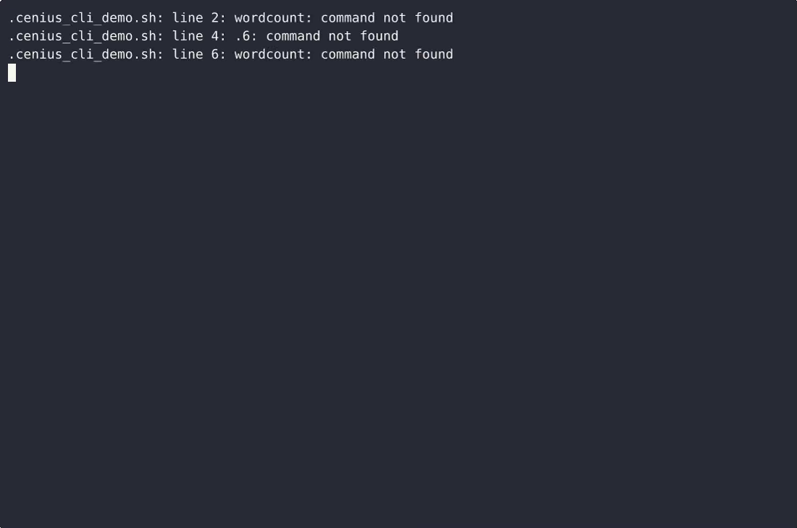
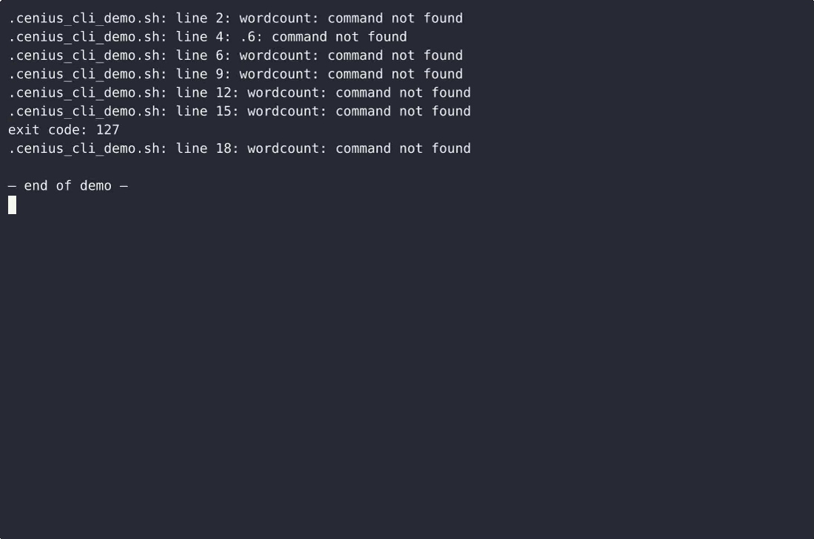

# wordcount-cli — complete Full-stack app command-line tool example app

Clone it. Run it. Own it. **wordcount-cli** is a complete, Apache-2.0-licensed command-line tool in Full-stack app — full source, demo data included. A single-file plain-Python CLI, wordcount.py, that reads one text file path given on the command line and prints how many whitespace-separated words it contains, with a usage line, --help, and clear non-zero exits on…. Self-host wordcount-cli on your own infrastructure, or open it on [cenius.ai](https://cenius.ai/marketplace/p/wordcount-cli-6?ref=gh&utm_campaign=wordcount-cli-webapp-6) to request changes and get a wordcount-cli fresh build.


[](LICENSE)  [](https://cenius.ai)

[](https://cenius.ai/marketplace/p/wordcount-cli-6?ref=gh&utm_campaign=wordcount-cli-webapp-6)

> **▶ [Open & edit in cenius.ai](https://cenius.ai/marketplace/p/wordcount-cli-6?ref=gh&utm_campaign=wordcount-cli-webapp-6)** — one click to an editable workspace: describe changes in plain English, get an instant preview, one-click deploy and host. Modifications made on the platform come with full rebrand & relicense rights.

_Local clone? See [Quick start](#quick-start) below. cenius.ai is the zero-setup path._

## Demo


▶ **[See it in action](https://cenius.ai/marketplace/p/wordcount-cli-6?ref=gh&utm_campaign=wordcount-cli-webapp-6)** — full demo on the project page · [MP4](.github/media/demo.mp4)

## Screenshots

 

## Quick start

```bash
./install.sh   # installs dependencies + seeds demo data
```

See [`INSTALL.md`](INSTALL.md) for full setup and usage instructions.

## Architecture

Everything runs out of the box: a Full-stack app codebase (27 files). Kick off `./install.sh` to pull packages and seed the database, then the app is up. Top-level layout: `examples/`, `tests/`. For environment-specific setup, see [`INSTALL.md`](INSTALL.md).

## Features

- Count words in a file
- Command-line surface

## Usage guide

Every walkthrough below uses the real command and the files that ship in
`examples/`. Copy-paste from the repository root.

### Count the words in a file

```bash
$ python3 wordcount.py examples/release-notes.txt
203
```

`203` is the only thing on stdout — no headers, no padding — so the output can
be captured or piped directly.

```bash
$ python3 wordcount.py examples/release-notes.txt > count.txt
$ cat count.txt
203
```

### Words are split on any whitespace

Spaces, tabs and newlines all separate words, and runs of whitespace collapse:

```bash
$ printf 'alpha\tbeta\ngamma  delta\n' > /tmp/mixed.txt
$ python3 wordcount.py /tmp/mixed.txt
4
```

### An empty file is a result, not an error

```bash
$ python3 wordcount.py examples/empty.txt
0
$ echo $?
0
```

A file containing only whitespace also counts 0.

### A path that cannot be read

The message names the path and nothing lands on stdout, so a caller that pipes
the output never receives a bogus number:

```bash
$ python3 wordcount.py missing.txt
error: cannot read missing.txt
$ echo $?
1
```

The same exit code 1 covers a directory argument, a permission failure and a
file that is not valid UTF-8 (that last one adds `: file is not valid UTF-8` to
the message).

### Forgetting the path

```bash
$ python3 wordcount.py
usage: wordcount.py [-h] [--version] path
$ echo $?
2
```

Usage errors exit 2, so a shell script can tell "I called it wrong" apart from
"the file could not be read".

### Help and version

_Full guide: [`USAGE.md`](USAGE.md)_

## FAQ

### Can I deploy wordcount-cli on my own infrastructure?

`git clone` + `./install.sh` gets you a running instance — the install script provisions dependencies and demo data. Full steps live in [`INSTALL.md`](INSTALL.md); nothing external is needed to try it.

### How do I customise wordcount-cli's branding?

Absolutely. [Open it on cenius.ai](https://cenius.ai/marketplace/p/wordcount-cli-6?ref=gh&utm_campaign=wordcount-cli-webapp-6) and remix it there — platform modifications come with full rebrand and relicense rights over your derivative, so the result is entirely yours.

### What is wordcount-cli built with?

Full-stack app. The full source in this repository is exactly what the app runs. Highlights include command-line surface.

### How can I customize wordcount-cli without editing code?

The easiest route: [visit the project on cenius.ai](https://cenius.ai/marketplace/p/wordcount-cli-6?ref=gh&utm_campaign=wordcount-cli-webapp-6), tell the platform what to change, and collect the updated build. No source-editing needed.

### Can I use wordcount-cli in a commercial project?

Yes — Apache-2.0-licensed, so commercial use, modification, and distribution are all permitted. Read the full terms in [LICENSE](LICENSE).

## License & rebranding

Released under the [Apache License 2.0](LICENSE) (© 2026 Cenius AI) — free for personal and commercial use. The Cenius name/logo are trademarks (see NOTICE).

**Need a customized version?** [Remix this app on cenius.ai](https://cenius.ai/marketplace/p/wordcount-cli-6?ref=gh&utm_campaign=wordcount-cli-webapp-6) — modifications made on the platform come with **full rebrand & relicense rights** over your derivative.

## Built with cenius.ai

This entire application — code, design, seeded demo data — was generated on **[cenius.ai](https://cenius.ai)** from a plain-English description.

- 🚀 [Build your own app on cenius.ai](https://cenius.ai)
- 🎛️ [Remix wordcount-cli on the marketplace](https://cenius.ai/marketplace/p/wordcount-cli-6?ref=gh&utm_campaign=wordcount-cli-webapp-6) — open it in a workspace, prompt for changes, and ship your own version.

More open-source apps: [the Cenius-ai catalog](https://github.com/Cenius-ai) · [showcase index](https://github.com/Cenius-ai/showcase)
